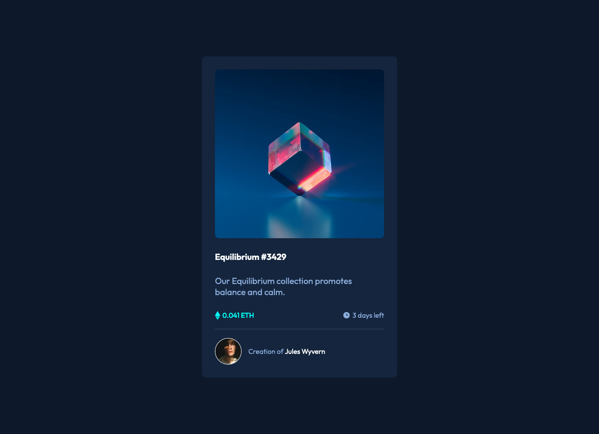
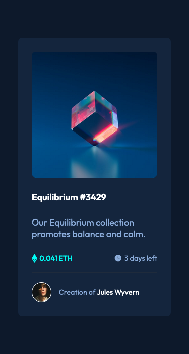

# Frontend Mentor - NFT preview card component solution

This is a solution to the [NFT preview card component challenge on Frontend Mentor](https://www.frontendmentor.io/challenges/nft-preview-card-component-SbdUL_w0U). Frontend Mentor challenges help you improve your coding skills by building realistic projects. 

## Table of contents

- [Overview](#overview)
  - [The challenge](#the-challenge)
  - [Screenshot](#screenshot)
    - [Desktop](#desktop)
    - [Mobile](#mobile)
  - [Links](#links)
- [My process](#my-process)
  - [Built with](#built-with)
  - [What I learned](#what-i-learned)
  - [Continued development](#continued-development)
  - [Useful resources](#useful-resources)
- [Author](#author)

## Overview

### The challenge

Users should be able to:

- View the optimal layout depending on their device's screen size
- See hover states for interactive elements

### Screenshot

#### Desktop

#### Mobile

### Links

- Solution URL: [Add solution URL here](https://your-solution-url.com)
- Live Site URL: [Add live site URL here](https://your-live-site-url.com)

## My process

### Built with

- Semantic HTML5 markup
- CSS custom properties
- Flexbox
- Mobile-first workflow
- [React](https://reactjs.org/) - JS library

### Useful resources

- [W3 Schools: Image Overlay Fade](https://www.w3schools.com/howto/howto_css_image_overlay.asp) - This helped me add the styling for the active state on the NFT product image.

## Author

- Website - [Web Dev Portfolio](https://ananfito.github.io)
- Frontend Mentor - [@ananfito](https://www.frontendmentor.io/profile/ananfito)
- Mastodon - [@infinifito@hachyderm.io](https://hachyderm.io/@infinifito)
- Twitter - [@wordsbyfifi](https://www.twitter.com/wordsbyfifi)
